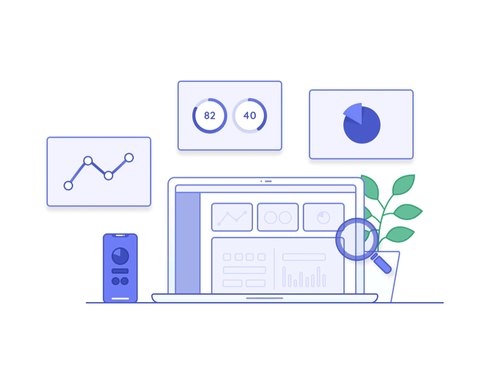

## Hi there 👋

Soy estudiante de Ingeniería en Inteligencia de Datos y Ciberseguridad. Me gusta analizar datos, construir modelos y entender cómo la tecnología puede resolver problemas reales. Siempre estoy aprendiendo algo nuevo y creando proyectos que mezclen datos, inteligencia artificial y seguridad

  <i>Let's connect and chat!</i>

  

    
    
    
  

## Learning

🛠️ Languages and Tools:

- Lenguajes: Python, JavaScript, SQL, C++, C#, Bash/Shell
- Herramientas y Frameworks: Docker, VS Code, Jupyter Notebook, Pandas, NumPy, Power BI
- Data: Análisis de datos, Machine Learning, Procesamiento, Visualización y Modelado de datos, Big Data, Limpieza y transformación (ETL)

 

## Stats

<!--
**Villedana12/Villedana12** is a ✨ _special_ ✨ repository because its `README.md` (this file) appears on your GitHub profile.

Here are some ideas to get you started:

- 🔭 I’m currently working on ...
- 🌱 I’m currently learning ...
- 👯 I’m looking to collaborate on ...
- 🤔 I’m looking for help with ...
- 💬 Ask me about ...
- 📫 How to reach me: ...
- 😄 Pronouns: ...
- ⚡ Fun fact: ...
-->
